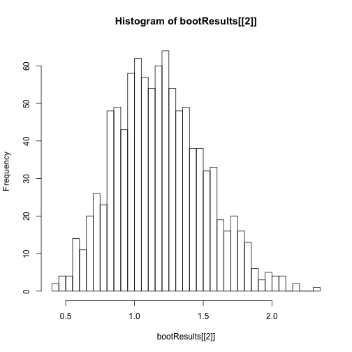

<style>
  .reveal pre {font-size: 12px;}
</style>

Simulation Examples
========================================================
author: Stat133
date: 26 Feb 2015
transition: none
#font-family: 'Garamond'

Probability and Statistics
===
We can think of probability theory as complimentary to statistical inference.

**Probability Theory** : 
Probability Distribution $\rightarrow$ Observed Data

**Statistical Inference** : 
Observed Data $\rightarrow$ Probability Distribution

A Statistic - review from last lecture
===
A **statistic** is often just a function of a random sample, for example the sample mean, the 95th quantile, or the sample proportion.

Statistics are often used as estimators of quantities of interest about the distribution, called parameters.  Statistics are random variables (since they depend on the sample); parameters are not.

In simple cases, we can study the sampling distribution of the statistic analytically.  For example, we can prove that under mild conditions the distribution of the sample proportion is close to normal for large sample sizes. 

In more complicated cases, we turn to simulation.


Simulation - Recap
===
The main idea in a simulation study is to replace the mathematical expression for a probability distribution (or model) with a sample from that distribution.

We use the sample to estimate features of the distribution, such as the behavior of various statistics under repeated sampling from the distribution.

Statisticians routinely use simulations to evaluate complicated methods for which exact mathematical results are difficult or impossible to obtain.

The downside: whereas mathematical results are symbolic, in terms of arbitrary parameters and sample size, in a simulation we must specify particular values.

Steps of a Simulation Study
===
1. Specify what makes up an individual experiment: sample size, distributions, parameters, statistic of interest.
2. Write an expression or function to carry out an individual experiment and return the statistic.
3. Determine what inputs, if any, to vary (e.g. different sample sizes or parameters).
4. For each combination of inputs, repeat the experiment B times, providing B samples of the statistic.
5. For each combination of inputs, summarize the empirical distribution of the statistic of interest.
6. State and/or plot the results.  (Sometimes go back to 3.)

Note: the large B is the better the approximation.


First Example - Coin Flip
===
**Probability** allows us to quantify statements about the chance of an event taking place. 

Example : Flip a fair coin 
- What’s the chance it lands heads?
- Flip it 4 times, what proportion of heads do you expect?
- Will you get exactly that proportion?
- What happens when you flip the coin 1000 times?

Probability Distribution - Coin Flip
===
Seqence of flips | # Heads   | Seqence of flips | # Heads
----            |--------   |----               | ----
HHHH            |4          | HTTH              | 2 
HHHT            |3          | THTH              | 2 
HHTH            |3          | TTHH              | 2 
HTHH            |3          | HTTT              | 1 
THHH            |3          | THTT              | 1 
HHTT            |2          | TTHT              | 1 
HTHT            |2          | TTTH              | 1 
THHT            |2          | TTTT              | 0

16 possible sequences, each equally likely.  The probability distribution for the random variable X=#heads in 4 flips is:
$$P(X=0)=\frac{1}{16}, P(X=1)=\frac{1}{4},P(X=2)=\frac{3}{8}$$
$$P(X=3)=\frac{1}{4},P(X=4)=\frac{1}{16}$$

Statistic - Coin Flip
====

We can think of the number of Heads in 4 flips as a **statistic** because it summarizes data

Notice that it is a random quantity – it takes on 5 possible values, each with some probability.

Coin Flip
===
 1,000 Flips
When we flip the coin 1,000 times, we can get a many different possible proportions of Heads, i.e. 0, 0.001, 0.002, 0.003, …, 0.998, 0.999, 1.000

It’s highly unlikely that we would get 0 for the proportion – how unlikely?

What does the distribution of the proportion of heads in 1000 flips look like?


1,000 Flips
===
- We can figure this out analytically.  
- But we can also get a good idea using a simulation.
- In our simulation we will assume that the chance of Heads is 0.5 and find out what the possible values for the proportion of heads in 1,000 flips looks like.
- If we were to carry out an experiment with a coin  and get a particular proportion, say 0.37, then we could use this simulation study to help us understand the results of our experiment.

Sampling from a discrete set
===
To carry out the simulation study we use the function:

sample(x, size, replace = FALSE, prob = NULL)
 
Think of an urn with tickets, each ticket marked with a value.   Mix up the tickets and draw one at a time from the urn

- x = vector with one element for each ticket, values correspond to what is written on the ticket. 
- size = number of draws to take from the urn 
- replace = replace the ticket between draws or not. 
- prob = set of  weights for the elements in x (an element might represent more than one ticket)

Coin Flip in R
===

```r
set.seed(1101)
coin = c("T", "H")

# Flip the coin once
sample(coin, 1, replace = TRUE)
```

```
[1] "T"
```

```r
# Flip the coin 4 times
n = 4
tosses = sample(coin, n, replace = TRUE)
tosses
```

```
[1] "H" "T" "H" "T"
```

Coin Flip in R - fraction of Heads
===
How many Heads did we get?

```r
sum(tosses == "H")
```

```
[1] 2
```

What proportion of Heads did we get?

```r
sum(tosses == "H")/length(tosses)
```

```
[1] 0.5
```

Coin Flip in R - function
===
It might be easier to track using 0 for tails and 1 for heads

```r
coin = 0:1
n = 4
tosses = sample(coin, n, replace = TRUE)
```

And we can put this into a function, coinToss(), that takes one argument, n=#coin tosses, and return the *fraction* of tosses that came up Heads (or 1 in this case).

```r
coinToss = function(n=4){
  return( sum(sample(0:1, n, replace=TRUE)/n) )
}
```
Coin Flip Simulation
===
What about estimating the distribution of the proportion or
number of heads in 4 tosses?

Note that is the distrubution on slide 2.

We could conduct an experiment where we run our 4-toss process
many many times and see empirically what proportion of the times
did we get 0, 1, 2, 3, or 4 heads.

We will present three ways to do this in R.

Coin Flip Simulation with a for-loop
===
We use the function coinToss() that we just created.

```r
n.toss <- 4
n.iter <- 1000

# initialize samplesA
samplesA = numeric()

for (i in 1:n.iter){
  samplesA[i] = coinToss(n.toss)
}
length(samplesA)
```

```
[1] 1000
```

```r
table(samplesA)/n.iter
```

```
samplesA
    0  0.25   0.5  0.75     1 
0.074 0.288 0.329 0.241 0.068 
```

```r
c(1/16, 1/4, 3/8, 1/4, 1/16)
```

```
[1] 0.0625 0.2500 0.3750 0.2500 0.0625
```

Coin Flip Simulation with replicate()
===
Notice that the index *i* in the for-loop was only used to enumerate the number of times 
we called the function and the call to coinToss() does not depend on *i*.  
We can use the replicate() function in R to replace for-loops in cases like these.


```r
samplesB = replicate(n.iter, coinToss(n.toss))

table(samplesB)/n.iter
```

```
samplesB
    0  0.25   0.5  0.75     1 
0.064 0.240 0.400 0.225 0.071 
```


Coin Flip Simulation with sapply()
===

```r
samplesC = sapply(1:n.iter, function(iter){sum(sample(0:1, n.toss, replace=TRUE))/n.toss})

length(samplesC)
```

```
[1] 1000
```

```r
head(samplesC)
```

```
[1] 0.50 0.50 0.50 0.50 0.75 0.50
```

```r
table(samplesC)
```

```
samplesC
   0 0.25  0.5 0.75    1 
  59  207  389  280   65 
```

Of the three methods to simulate the coin toss which one do you prefer?

Coin Flip 
===
Notice that each time we get slightly different answers.
That's because we are working with a "random" process and
each time we get slightly different answers.

We can also use the computer to study the behavior of
a chance process as the sample size increases.

For example, how does the proportion of heads behave as
the number of flips increases?

Coin Flip - fraction of Heads
===
Lets generate 2000 tosses (so just a sequence of T/H or 0/1)

```r
n = 2000
tosses = sample(coin, n, replace = TRUE)
```

We can calculate the *cumulative sum* of this sequence using the function cumsum(), and the cumulative proportion by dividing with the number of observations *so far*.

```r
cumProp = cumsum(tosses)/(1:n)
```

Plot
===
Let's plot this

```r
plot(x = 1:n, y = cumProp, type = "l",  ylim = c(0, 1))
abline(h = 0.5, col = "grey")
```

 

Plot
===
We can repeat this process a few times and overlay the plots.  What do you notice?

```r
plot(x = 1:n, y = cumProp, type = "l",  ylim = c(0, 1))
abline(h = 0.5, col = "red")
for(i in 1:5){
  tosses = sample(coin, n, replace = TRUE)
  cumProp = cumsum(tosses)/(1:n)
  lines(x = 1:n, y = cumProp, type = "l",  col="grey", ylim = c(0, 1))
}
```

 

Functions to draw at random
===
In the coin toss example we only needed the function sample() to draw observations at random.  Other commonly used functions follow.

Uniform distribution
===
samples from the uniform distribution on the interval (0, 1). 

```r
n = 10
runif(n, min = 0, max = 1) 
```

```
 [1] 0.7420352 0.8582766 0.8380826 0.3833590 0.4961425 0.7931019 0.1532129
 [8] 0.4177698 0.5190493 0.4511704
```
The probability that the value drawn is in the interval [a,b] (where $0 \leq a \leq b \leq 1$) is b-a.

So the chance the value drawn is:
- between 0 and 1/3 has chance 1/3
- between 1/3 and 1/2 has chance 1/6  
- between 9/10 and 1 has chance 1/10

The min and max allow you to change the interval from which to sample, e.g. min = 100, max = 150 will produce random values between 100 and 150

Normal distribution
===
Standard Probability Distributions:

rnorm(n, mean = 0, sd = 1)

sample from the normal distribution with center = mean and spread = sd

Binomial Distribution
===
rbinom(n, size, prob)

sample from the binomial distribution with number of trials = size and chance of success = prob

Other distributions
===
rexp(), rpois(), rt(), rf() – each has arguments for parameter values relevant to the distribution.

See ?Distributions for more information


Median of a Normal
===
Example:  Carry out a simulation study of the median when sampling from the normal distribution.  How does it vary with the sample size and with the standard deviation of the normal distribution?

Generate $n$ random normal values from a $N(0, s^2)$ and take the median of these $n$ values


```r
n = 27
s = 3
median(rnorm(n = n, sd = s))
```

```
[1] 1.793677
```

Median of a Normal
===
Repeat the experiment $B$ times and examine the distribution of the $B$ medians

```r
B = 1000
sampleMs = replicate(1000, median(rnorm(n = n, sd = s)))
mean(sampleMs)
```

```
[1] 0.04097606
```

```r
sd(sampleMs)
```

```
[1] 0.7187624
```
Median of a Normal
===

```r
hist(sampleMs)
```

 

Repeat Simulation
===
Repeat the simulation for different values of $n$ and $s$ and compare/Examine the behavior for these different values

```r
ns = seq(20, 200, by = 10)
ss = seq(1, 10, by = 0.5)
samples = matrix(nrow = length(ns), ncol = length(ss))
for (i in 1:length(ns)) {
  for (j in 1:length(ss)) {
   samples[i , j] =  mean(replicate(1000, median(rnorm(n = ns[i], sd = ss[j]))))
  }
}
```

Plot output
===

```r
matplot(t(samples), type="l")
```

 


Biham-Middleton-Levine traffic model
===
A Simulation Study, question(s)
- Traffic flow in a large city grid 
- Is there a largest traffic density that permits free flow? 
- Is there a density above which gridlock is inevitable? 

In 1992 Biham, Middleton and Levine introduced a simplified model for the study of these questions, called the BML model. 

BML Model
===
- Each intersection of a square grid of streets contains either a red car, a blue car, or an empty space. 
- At each odd-numbered time step, all blue cars simultaneously attempt to move one unit North;
- A car succeeds if there is already an empty space for it to move into. 
- At each even-numbered time step, the red cars attempt to move East in the same way. 

BML Model
===
- A blue car that falls off the North edge of the grid reappears in the same position at the South edge; 
- Similarly red cars falling off the East edge reappear on the West edge. 
- Initially, cars are distributed at random: each intersection is independently assigned a car with probability p, or an empty space with probability 1 - p. 
- Each is car is independently equally likely to be red or blue. 

BML Model
===
Is there a density above whichgridlock is inevitable? 

Phase Transitions
===
BML is perhaps the simplest system exhibiting phase transitions and self organization
General belief: the system exhibits a sharp phase transition from free flowing to fully jammed, depending on p – the initial density of cars.
- BML p=0.80
- BML p=0.34
- BML p=0.32
- BML p=0.32
- BML p=0.10

BML Model
===
- When p = 80%, traffic becomes jammed, and no car can move at all. 
- For low densities (e.g. 10%), after a while traffic is completely free flowing, and no car ever has to wait at all. 

The model appears to also exhibit large-scale organization:
- When p is 34% there is a single jam spanning the entire grid, 
- At around 30% picture the cars arrange themselves into wide diagonal bands that avoid each other. 
- At 32%, all cars move some of the time and wait some of the time, and this is achieved by semi-regular geometric patterns of jams feeding into each other. 


BML Model(Wikipedia Page
http://en.wikipedia.org/wiki/Biham-Middleton-Levine_traffic_model


BML Model - Homework
=== 
- Representation of data
- functions
- What information do we want to store and look at 


Cross-Validation
===
Cross validation is a technique for assessing how well the results of some statistical analysis will generalize to an independent data set.  

Using the same data to create the model as well as assess the model can lead to an overly optimistic view of how well the model will be able to make predictions in an independent data set.  

The idea of cross validation is to leave some data aside as a test set (to assess the predictions) while the rest of the data is a training set used to make decisions about how to make predictions.

Cross-Validation Example
===
Assume that both X and Y can only take the values 0 and 1.  There are 4 possible values for (X, Y):
- X=0, Y=0
- X=0, Y=1
- X=1, Y=0
- X=1, Y=1

We wish to predict Y based on X, so we adopt the rule that :
- if X=0, predict Y=0, and 
- if X=1, predict Y=1 (or predict 0, it doesn’t matter).  

This will correctly predict Y 3/4 of the time.  Now suppose that both X and Y are the results of coin tosses, 50% chance of 0 or 1.  Based on this, we know that future predictions will only be right half the time using this model.  

Cross-Validation 
===
The idea of cross validation would be to 
- leave out some data as a training set, 
- choose our prediction rule based on the rest of the data, 
- then see how well the prediction rule works for the left out data.  

Cross-Validation 
===
If the first point is left out, our prediction rule remains the same and it will correctly predict the Y value for the value left out (the training set).  

If the second is left out, the same thing will happen, correct prediction.  

If the third or fourth points are left out, the prediction based on the other value will always be wrong.  

In other words, if (1,0) is left out, the point (1,1) will tell us to predict Y=1 when X=1, and this prediction will be wrong for the point left out.  Based on the test sets, correct predictions should only be expected half the time.


Cross-Validation Code 
===
Lets creat a toy example.  We make a dataset with 30 observations on height, weight and GPA.  Notice the structure in height and weight.  Also note that GPA is independent of height and weight.

```r
ht = rep(c(65, 67, 69, 70, 71), each = 6)
wt = rep(c(120, 125, 130, 140, 150, 160), times = 5)
gpa = round(runif(30, min = 3.3, max = 4), 2)
aClass = data.frame(ht = ht, wt = wt, gpa = gpa)
```

Cross Validation
===
Now let's try to predict GPA based on height and weight.  We create a simple prediction system where we check if there is an individual in the training set with the given height and weight and match the GPA, if not we simply set the prediction to 4.

```r
myGrtPred = function(newH, newW, train = aClass){
  htMatch = which(newH == train$ht)
  wtMatch = which(newW == train$wt)
  bothMatch = which(htMatch %in% wtMatch)
  # if we found a match, pick the first match
  if (length(bothMatch) > 0) pred = train$gpa[htMatch[bothMatch[1]]]
  else pred = 4.0
  return(pred) 
}
```

Cross Validation
===
Use the model to predict the grade of someone with the height and weight of the first observation.

```r
myGrtPred(newH = aClass$ht[1], newW = aClass$wt[1])
```

```
[1] 3.86
```

```r
aClass$gpa[1]
```

```
[1] 3.86
```

Prediction by row
===

```r
Preds = rep(0, nrow(aClass))
for (i in 1:nrow(aClass)){
  Preds[i] = 
    myGrtPred(newH = aClass$ht[i], newW = aClass$wt[i])
}
#Preds = mapply(myGrtPred, newH = aClass$ht, newW = aClass$wt)

Preds
```

```
 [1] 3.86 3.83 3.56 3.55 3.46 3.39 3.91 3.34 3.58 3.46 3.63 3.84 3.74 4.00
[15] 3.41 3.41 3.79 3.76 3.31 3.45 3.96 3.68 3.82 3.70 3.97 3.48 3.69 3.50
[29] 3.88 3.50
```

```r
aClass$gpa
```

```
 [1] 3.86 3.83 3.56 3.55 3.46 3.39 3.91 3.34 3.58 3.46 3.63 3.84 3.74 4.00
[15] 3.41 3.41 3.79 3.76 3.31 3.45 3.96 3.68 3.82 3.70 3.97 3.48 3.69 3.50
[29] 3.88 3.50
```

```r
all(aClass$gpa == Preds)
```

```
[1] TRUE
```
Cross Validation
===


```r
dim(aClass)
```

```
[1] 30  3
```

```r
mixUpRows = sample(nrow(aClass))

test = aClass[mixUpRows[1:15], ]
train = aClass[-mixUpRows[1:15], ]

#TestPreds = mapply(myGrtPred, newH = test$ht, newW = test$wt, train = train)

TestPreds = rep(0, nrow(test))
for (i in 1:nrow(test)){
  TestPreds[i] = myGrtPred(newH = test$ht[i], 
                           newW = test$wt[i],
                           train = train)
}

sum(test$gpa == TestPreds)
```

```
[1] 1
```

Number of correct predictions
===

```r
test = aClass[mixUpRows[16:30], ]
train = aClass[-mixUpRows[16:30], ]
correctPreds = rep(FALSE, nrow(test))
for (i in 1:nrow(test)){
  correctPreds[i] = test$gpa[i] == myGrtPred(newH = test$ht[i],  newW = test$wt[i], train = train)
}
sum(correctPreds)
```

```
[1] 0
```

Bootstrap
===
A simple bootstrap function:

```r
bootStrapS = function(mySample, B = 1000){
    replicate(B, mean(sample(mySample, length(mySample), TRUE)))
}
```

Bootstrap
===
Another version, what are we doing here?

```r
bootStrap = function(mySample, popSize = NULL, B = 1000, repl = FALSE){
  if (repl) {
    return(replicate(B, mean(sample(mySample, length(mySample), TRUE))))
  } else {
    vals = sort(unique(mySample))
    counts = table(mySample)
    bootPop = rep(vals, round(counts * popSize / length(mySample))) # create a new sample population
    return(list(bootPop, bootSamps = replicate(B, mean(sample(bootPop, length(mySample), FALSE)))))
  }
}
```

Bootstrap
===

```r
mySample = rnorm(500)
bootSampAvgs = bootStrap(mySample, popSize = 1200)
length(bootSampAvgs[[2]])
```

```
[1] 1000
```

```r
head(bootSampAvgs[[2]])
```

```
[1]  0.02566414 -0.07087096  0.01657244 -0.08823856  0.04598010 -0.05248304
```

```r
mean(bootSampAvgs[[2]])
```

```
[1] -0.01273069
```

Bootstrap
===

```r
hist(bootSampAvgs[[2]], breaks = 30)
```

 

Bootstrap - Videogame Data
===
In Fall 1994, 314 students were enrolled in Stat 2, Section 1.  Ninety-five were selected at random to participate in a survey.  Amongst other questions, they were asked how many hours of video games they played in the last week.  Ninety-one answered, and the average number of hours was 1.24 hours.  How accurately does this estimate the population average?

Bootstrap - Videogame Data
===

```r
videoSample =rep(c(0,.1,.5,1,1.5,2,3,4,5,14,30), times = c(57,1,5,5,1,14,3,1,1,2,1))
videoSample
```

```
 [1]  0.0  0.0  0.0  0.0  0.0  0.0  0.0  0.0  0.0  0.0  0.0  0.0  0.0  0.0
[15]  0.0  0.0  0.0  0.0  0.0  0.0  0.0  0.0  0.0  0.0  0.0  0.0  0.0  0.0
[29]  0.0  0.0  0.0  0.0  0.0  0.0  0.0  0.0  0.0  0.0  0.0  0.0  0.0  0.0
[43]  0.0  0.0  0.0  0.0  0.0  0.0  0.0  0.0  0.0  0.0  0.0  0.0  0.0  0.0
[57]  0.0  0.1  0.5  0.5  0.5  0.5  0.5  1.0  1.0  1.0  1.0  1.0  1.5  2.0
[71]  2.0  2.0  2.0  2.0  2.0  2.0  2.0  2.0  2.0  2.0  2.0  2.0  2.0  3.0
[85]  3.0  3.0  4.0  5.0 14.0 14.0 30.0
```


Bootstrap - Videogame Data
===

```r
length(videoSample)
```

```
[1] 91
```

```r
mean(videoSample)
```

```
[1] 1.242857
```

```r
hist(videoSample, breaks = 30)
```

 

Bootstrap - Videogame Data
===
Notice that the empirical distribution has a very long tail and few observations in the tail.  

The second version of the bootstrap function, where we scale up the population size, is 
useful in cases like these.

Bootstrap - Videogame Data
===

```r
bootResults = bootStrap(videoSample, popSize = 314)
head(bootResults[[1]])
```

```
[1] 0 0 0 0 0 0
```

Bootstrap - Videogame Data
===

```r
hist(bootResults[[1]], breaks = 30)
```

 

Bootstrap - Videogame Data
===

```r
length(bootResults[[2]])
```

```
[1] 1000
```

```r
head(bootResults[[2]])
```

```
[1] 0.9230769 1.7967033 1.9791209 1.2989011 1.3406593 1.2813187
```

```r
mean(bootResults[[2]])
```

```
[1] 1.189114
```

Bootstrap - Videogame Data
===

```r
hist(bootResults[[2]], breaks = 30)
```

 

Web Caching
===
- When you use a search engine to look for a Web page, the search engine looks through its cache. 
- The cache is created by regularly crawling the web and taking copies of every page that has changed since the last time it visited the site. 
- It’s time consuming and costly to crawl the web. 
- How often do you need to crawl the web in order to keep its stock fresh for the search engine?

Web Caching
===
- Data: a collection of web sites were visited regularly over a period of time to see whether or not they had changed.
- Question: Given a new website, how often would you recommend as the length of time between visiting the site?


```
Error in readChar(con, 5L, useBytes = TRUE) : cannot open the connection
```
